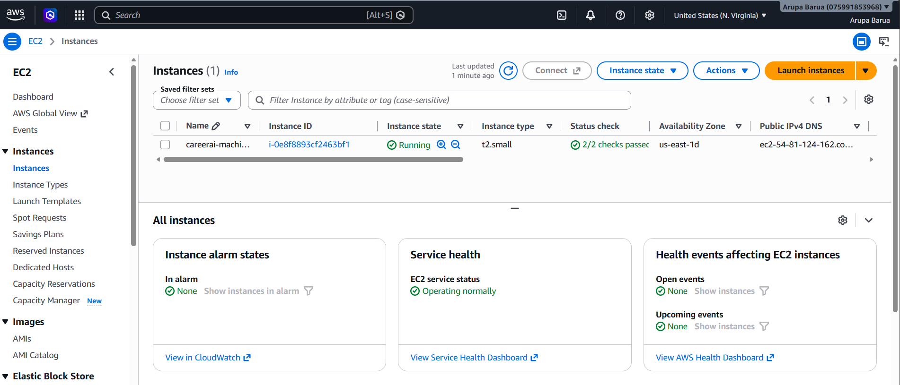

# 🤖 CareerAI — Agentic AI Career Assistant

[](http://54.81.124.162:8000)

CareerAI is an end-to-end **agentic AI career assistant** built with **LangGraph, LangChain, FastAPI, PostgreSQL, FAISS, Neo4j, MCP, and LangSmith**. CareerAI combines conversational memory, resume-derived context through corrective RAG and GraphRAG, live job search, external web tools, response evaluation, and a chatbot-style interface.

The application is containerized with **Docker** and deployed to **AWS EC2** through an automated **GitHub Actions CI/CD pipeline**, with Docker images stored in **AWS ECR**, PostgreSQL hosted on **Neon**, graph data stored in **Neo4j AuraDB**, and persistent FAISS resume indexes stored on the EC2 instance's EBS-backed filesystem.

---

## 📖 Overview

CareerAI is a multi-agent career assistant built with LangGraph, where specialized agents and supporting subgraphs handle different categories of career-related requests.

The system supports:

- Current job search
- Resume and candidate-profile analysis
- Skill-gap and role-suitability analysis
- Career and role recommendations
- General career questions
- Short-term and long-term memory
- Semantic candidate context retrieval from uploaded resumes through CRAG
- Structured candidate knowledge retrieval through GraphRAG
- External web search
- Response evaluation and refinement

A routing agent first determines the user's intent and directs the request to the appropriate workflow.

Candidate-related requests use both **FAISS-backed Corrective RAG (CRAG)** and **Neo4j GraphRAG** to ground responses in the user's actual profile. Job-search requests use external search tools to find current opportunities, while general career queries can access external information through tool integrations, including a remote **Model Context Protocol (MCP)** connection with Exa.

The application also includes persistent conversation history, authentication, resume management, LangGraph checkpointing, semantic long-term memory, tool-enabled agent workflows, CRAG-based knowledge refinement, LLM-driven response evaluation and refinement, LangSmith observability, and Docker-based deployment.

---

## 🏗️ Architecture

```text
                         ┌─────────────────────────┐
                         │        User / UI        │
                         │   HTML + CSS + JS       │
                         └────────────┬────────────┘
                                      │
                                      ↓
                         ┌─────────────────────────┐
                         │        FastAPI          │
                         │   REST API + SSE Chat   │
                         └────────────┬────────────┘
                                      │
                                      ↓
                         ┌─────────────────────────┐
                         │   CareerAI Main Graph   │
                         │       LangGraph         │
                         └────────────┬────────────┘
                                      │
                    ┌─────────────────┼─────────────────┐
                    │                 │                 │
                    ↓                 ↓                 ↓
        ┌──────────────────┐ ┌──────────────────┐ ┌──────────────────┐
        │ Candidate Career │ │    Job Search    │ │     General      │
        │      Agent       │ │      Agent       │ │      Agent       │
        └────────┬─────────┘ └────────┬─────────┘ └────────┬─────────┘
                 │                    │                    │
                 ↓                    ↓                    ↓
        ┌──────────────────┐   ┌───────────────┐   ┌───────────────┐
        │ Candidate Context│   │ DuckDuckGo    │   │ Exa MCP       │
        │     Subgraph     │   │ Job Search    │   │ Web Search    │
        └────────┬─────────┘   └───────────────┘   └───────────────┘
                 │
          ┌──────┴──────┐
          │             │
          ↓             ↓
 ┌────────────────┐ ┌────────────────┐
 │      CRAG      │ │    GraphRAG    │
 │                │ │                │
 │ FAISS Resume   │ │ Neo4j AuraDB  │
 │ Retrieval      │ │ Candidate     │
 │ + Evaluation   │ │ Knowledge     │
 └────────────────┘ └────────────────┘


                    Persistent Application State
                              │
              ┌───────────────┼────────────────┐
              │               │                │
              ↓               ↓                ↓
      ┌──────────────┐ ┌──────────────┐ ┌──────────────┐
      │ Neon         │ │ LangGraph    │ │ FAISS        │
      │ PostgreSQL   │ │ Store        │ │ Resume Index │
      │              │ │ + pgvector   │ │              │
      │ Users        │ │ Long-Term    │ │ EC2 / EBS    │
      │ Conversations│ │ Memory       │ │              │
      │ Messages     │ │              │ │              │
      │ Resumes      │ │              │ │              │
      │ Auth         │ │              │ │              │
      └──────────────┘ └──────────────┘ └──────────────┘


                         Deployment Pipeline

      ┌────────────────────────┐
      │   Code Push (GitHub)   │
      └────────────┬───────────┘
                   ↓
      ┌────────────────────────┐
      │  GitHub Actions CI/CD  │
      └────────────┬───────────┘
                   ↓
      ┌────────────────────────┐
      │   Docker Image Build   │
      │ GitHub-hosted Runner   │
      └────────────┬───────────┘
                   ↓
      ┌────────────────────────┐
      │    Push to AWS ECR     │
      └────────────┬───────────┘
                   ↓
      ┌────────────────────────┐
      │ Self-hosted EC2 Runner │
      │ Pull Latest Image      │
      └────────────┬───────────┘
                   ↓
      ┌────────────────────────┐
      │   Alembic Migrations   │
      └────────────┬───────────┘
                   ↓
      ┌────────────────────────┐
      │    CareerAI Docker     │
      │       Container        │
      └────────────┬───────────┘
                   ↓
      ┌────────────────────────┐
      │   Persistent FAISS     │
      │     EC2 / EBS          │
      └────────────────────────┘
```

The deployment workflow is defined under `.github/workflows/`. The `Continuous-Integration` job runs on a GitHub-hosted runner and builds and pushes the Docker image to Amazon ECR. The `Continuous-Deployment` job runs on a self-hosted GitHub Actions runner installed directly on the EC2 instance.

---

## ✨ Key Features

- **Multi-agent LangGraph architecture** — requests are routed to dedicated candidate-career, job-search, or general-purpose workflows based on user intent.
- **Intent-aware routing** — distinguishes between live job searches, resume analysis, skill-gap analysis, role recommendations, and general career questions.
- **Corrective RAG (CRAG)** — resume retrieval includes relevance evaluation and knowledge refinement rather than blindly using retrieved chunks.
- **FAISS resume retrieval** — uploaded resumes are parsed, chunked, embedded, and stored in persistent FAISS indexes for semantic candidate-profile retrieval.
- **GraphRAG with Neo4j** — candidate information is transformed into graph entities and relationships such as skills, projects, research, publications, institutions, organizations, roles, and certifications.
- **Parallel candidate-context retrieval** — structured graph knowledge and semantic resume evidence are retrieved together before candidate-focused responses are generated.
- **Live job search with tool calling** — the job-search agent invokes a DuckDuckGo-backed search tool to retrieve current job openings, allowing responses to use live external data instead of relying only on static model knowledge.
- **MCP integration** — Exa is integrated through a remote Model Context Protocol endpoint for external web research when required.
- **LLM-driven response evaluation and refinement** — generated responses are evaluated for contextual support and usefulness; unsupported answers are revised using the available context, while unhelpful outputs trigger query rewriting, retrieval of more relevant context, and another generation cycle to produce a stronger final response.
- **Short-term memory** — LangGraph's PostgreSQL checkpointer stores conversation state using conversation-specific thread IDs.
- **Long-term memory** — LangGraph Postgres Store with pgvector persists semantically searchable user memories across conversations.
- **Persistent application history** — users, conversations, messages, resumes, and authentication sessions are stored in Neon PostgreSQL.
- **Conversation-scoped resume selection** — a resume can be selected for a conversation and remains available through the LangGraph checkpoint for later messages in that thread.
- **Resume graph ingestion** — resume uploads update both the FAISS semantic index and Neo4j candidate graph.
- **Authentication** — JWT access tokens and server-side refresh sessions protect user-specific conversations and resumes.
- **Chatbot-style frontend** — vanilla HTML, CSS, and JavaScript provide conversation history, resume selection, Markdown rendering, status updates, and streamed responses.
- **LangSmith observability** — LangGraph and LLM executions can be traced and inspected through LangSmith.
- **Containerized deployment** — the complete application runs inside a Docker container.
- **Persistent FAISS storage on EC2** — FAISS indexes are mounted outside the container so they survive container replacement.
- **Automated CI/CD** — every push to `main` builds the image, pushes it to ECR, applies Alembic migrations, and deploys the latest container on EC2.

---

## 🧰 Tech Stack

| Category | Tools |
|---|---|
| Languages | Python 3.11, JavaScript |
| Backend | FastAPI, Uvicorn |
| Agentic AI | LangGraph, LangChain |
| LLM | gpt-4o-mini |
| Judge LLM | gpt-4o |
| Structured Output | Pydantic |
| Resume Retrieval | FAISS, LangChain Text Splitters |
| GraphRAG | Neo4j AuraDB |
| Corrective RAG | Custom LangGraph CRAG workflow |
| External Search | DuckDuckGo Search, Exa MCP |
| MCP | Model Context Protocol, LangChain MCP adapters |
| Short-Term Memory | LangGraph AsyncPostgresSaver |
| Long-Term Memory | LangGraph AsyncPostgresStore, pgvector |
| Database | PostgreSQL on Neon |
| ORM | SQLAlchemy Async ORM |
| Migrations | Alembic |
| Authentication | JWT, pwdlib / Argon2 |
| Resume Parsing | PyMuPDF |
| Observability | LangSmith |
| Frontend | HTML, CSS, Vanilla JavaScript |
| Markdown Rendering | marked, DOMPurify |
| Streaming | Server-Sent Events (SSE) |
| Containerization | Docker |
| CI/CD | GitHub Actions |
| Cloud | AWS EC2, AWS ECR, EBS |
| Testing | Pytest, pytest-asyncio |
| Code Quality | Ruff |

---

## 📁 Project Structure

```text
CareerAI/
├── .github/
│   └── workflows/
│       └── aws.yml                     # CI/CD: ECR build/push -> EC2 deployment
│
├── frontend/
│   ├── index.html                      # Main CareerAI interface
│   ├── css/
│   │   └── style.css
│   └── js/
│       ├── api.js                      # API client and access-token handling
│       ├── auth.js                     # Login/register/refresh workflow
│       ├── conversations.js            # Conversation API/state management
│       ├── chat.js                     # SSE chat streaming
│       └── app.js                      # Main frontend application logic
│
├── src/
│   ├── components/
│   │   ├── agents/
│   │   │   ├── routing_agent.py
│   │   │   ├── candidate_career_agent.py
│   │   │   ├── job_search_agent.py
│   │   │   └── general_agent.py
│   │   ├── auth/                       # Authentication services/dependencies
│   │   ├── conversations/              # Conversation persistence
│   │   ├── crag/                       # Corrective resume retrieval workflow
│   │   ├── database/
│   │   │   ├── connection.py
│   │   │   └── models.py
│   │   ├── evaluation/
│   │   │   └── response_evaluation.py
│   │   ├── graph/
│   │   │   ├── state.py
│   │   │   ├── main_graph.py
│   │   │   └── candidate_context_subgraph.py
│   │   ├── graphrag/                   # Neo4j ingestion and retrieval
│   │   ├── llm/                        # LLM configuration
│   │   ├── mcp/                        # Remote MCP integration
│   │   ├── memory/
│   │   │   ├── checkpointer.py         # LangGraph PostgreSQL STM
│   │   │   ├── store.py                # Semantic LTM store
│   │   │   ├── ltm_extractor.py
│   │   │   ├── ltm_service.py
│   │   │   ├── ltm_graph.py
│   │   │   ├── stm_service.py
│   │   │   └── stm_node.py
│   │   ├── messages/                   # Persistent message history
│   │   ├── resume/                     # Resume upload/parsing/persistence
│   │   └── retrieval/                  # FAISS resume vector retrieval
│   │
│   ├── constants/
│   │   └── settings.py
│   │
│   ├── routes/
│   │   ├── auth.py
│   │   ├── conversations.py
│   │   ├── messages.py
│   │   ├── resume.py
│   │   ├── chat.py
│   │   └── health.py
│   │
│   └── utils/
│
├── alembic/
│   └── versions/                        # PostgreSQL schema migrations
├── data/
│   └── faiss/                           # Local FAISS indexes (not committed)
├── alembic.ini
├── Dockerfile
├── .dockerignore
├── requirements.txt
├── pyproject.toml
├── main.py                              # FastAPI application entrypoint
└── LICENSE
```

---

## ✅ Prerequisites

- Python 3.11
- Conda or another Python virtual-environment manager
- Docker
- Neon PostgreSQL database
- pgvector extension enabled in PostgreSQL
- Neo4j AuraDB account
- OpenAI API key
- LangSmith account
- Exa MCP endpoint
- AWS account with access to EC2, ECR, EBS, and IAM
- GitHub repository with Actions enabled

---

## ⚙️ Setup & Installation

1. **Clone the repository**

   ```bash
   git clone <your-careerai-repository-url>
   cd CareerAI
   ```

2. **Create and activate the environment**

   ```bash
   conda create -n careerai python=3.11 -y
   conda activate careerai
   pip install -r requirements.txt
   ```

3. **Create the required environment variables**

   Create a `.env` file in the project root:

   ```env
   DATABASE_URL=postgresql+psycopg://<user>:<password>@<host>/careerai?sslmode=require

   OPENAI_API_KEY=<your-openai-api-key>

   LANGSMITH_API_KEY=<your-langsmith-api-key>
   LANGSMITH_TRACING=true
   LANGSMITH_PROJECT=career-ai

   EXA_MCP_URL=<your-exa-mcp-url>

   JWT_SECRET_KEY=<your-jwt-secret>
   REFRESH_COOKIE_NAME=<refresh-cookie-name>

   NEO4J_URI=<your-neo4j-uri>
   NEO4J_USERNAME=<your-neo4j-username>
   NEO4J_PASSWORD=<your-neo4j-password>
   NEO4J_DATABASE=<your-neo4j-database>
   ```

   The real `.env` file should never be committed to Git.

4. **Enable pgvector**

   In the PostgreSQL database:

   ```sql
   CREATE EXTENSION IF NOT EXISTS vector;
   ```

5. **Apply application database migrations**

   ```bash
   python -m alembic upgrade head
   ```

6. **Start the application**

   ```bash
   uvicorn main:app --reload
   ```

   CareerAI will be available at:

   ```text
   http://localhost:8000
   ```

FastAPI serves both the frontend and backend from the same origin, so a separate frontend development server is not required.

---

## 🚀 Usage

### Run CareerAI locally

```bash
uvicorn main:app --reload
```

Open:

```text
http://localhost:8000
```

### Upload a resume

Open the resume selector in the CareerAI interface and upload a PDF resume.

The resume has to be selected for resume related question answering.

The upload pipeline performs:

```text
PDF Resume
    ↓
PyMuPDF text extraction
    ↓
Text splitting
    ↓
Embedding generation
    ↓
FAISS index
    ↓
data/faiss/resumes/{user_id}/{resume_id}

    +

Resume information extraction
    ↓
Neo4j entities + relationships
    ↓
Candidate knowledge graph
```

Resume text and metadata are also persisted in PostgreSQL.

### Start a conversation

Create a new chat and ask questions such as:

```text
What projects have I worked on?

Am I suitable for an AI Engineer role?

What skills am I missing for an LLMOps position?

Find current remote AI Engineer jobs.

What should I learn to become a Generative AI Engineer?
```

Candidate-specific requests require selecting a resume for that conversation.

The selected resume ID is stored in the LangGraph checkpoint, so it remains associated with the same conversation across subsequent messages.

---

## 🐳 Run with Docker

Build the image:

```bash
docker build -t careerai:latest .
```

Create the local FAISS directory:

```bash
mkdir -p data/faiss
```

Run the container:

```bash
docker run --name careerai-local --env-file .env -p 8000:8000 -v "$(pwd)/data/faiss:/app/data/faiss" careerai:latest
```

The bind mount keeps FAISS indexes outside the container:

```text
Host
data/faiss
    ↕
Container
/app/data/faiss
```

Therefore replacing the application container does not remove the resume vector indexes.

---

## 🌐 API / Routes

| Route | Method | Description |
|---|---|---|
| `/` | GET | Serves the CareerAI frontend |
| `/auth/register` | POST | Registers a new user |
| `/auth/login` | POST | Authenticates a user and returns an access token |
| `/auth/refresh` | POST | Refreshes authentication using the refresh session |
| `/auth/logout` | POST | Revokes the active refresh session |
| `/conversations` | POST | Creates a conversation |
| `/conversations` | GET | Lists conversations belonging to the authenticated user |
| `/conversations/{conversation_id}` | DELETE | Deletes a conversation |
| `/conversations/{conversation_id}/messages` | GET | Loads persisted user/assistant message history |
| `/resumes` | POST | Uploads and processes a PDF resume |
| `/resumes` | GET | Lists uploaded resumes |
| `/resumes/{resume_id}` | DELETE | Deletes a resume |
| `/chat/conversations/{conversation_id}/resume` | GET | Returns the resume currently associated with a conversation |
| `/chat/conversations/{conversation_id}/stream` | POST | Executes the CareerAI graph and streams status/response events |
| `/health` | GET | Application health endpoint |

---

## 🧠 Agentic Workflow

CareerAI's root LangGraph performs the high-level orchestration:

```text
User Message
     ↓
Long-Term Memory Retrieval
     ↓
Conversation Summarization / STM
     ↓
Intent Router
     ↓
 ┌──────────────┬───────────────┬──────────────┐
 ↓              ↓               ↓
Candidate      Job Search      General
Career Agent   Agent           Agent
```

The router supports the following intents:

```text
job_search
resume_analysis
skill_gap
job_recommendation
general
```

`job_search` is reserved for finding current vacancies.

`resume_analysis`, `skill_gap`, and `job_recommendation` are handled by the candidate-career workflow and are grounded in candidate evidence rather than external search alone.

---

## 🔎 Candidate Retrieval — CRAG + GraphRAG

Candidate-related requests use two complementary retrieval systems.

### CRAG / FAISS

Resume text is retrieved semantically from FAISS.

```text
Query
  ↓
FAISS Retrieval
  ↓
Retrieval Evaluation
  ↓
Correct / Ambiguous / Incorrect
  ↓
Knowledge Refinement / Query Rewrite
  ↓
Candidate Text Context
```

This prevents weak retrieval results from being blindly passed to the final LLM.

### GraphRAG / Neo4j

Resume-derived information is also represented as a candidate graph.

Examples of modeled entities include:

```text
Skill
Role
Company
Organization
Institution
Experience
Project
Research
Publication
Activity
Certification
```

Relationships capture structured candidate knowledge such as:

```text
HAS_SKILL
HAS_ROLE
HAS_EXPERIENCE
WORKED_AT
STUDIED_AT
WORKED_ON
CONDUCTED_RESEARCH
AUTHORED
PARTICIPATED_IN
MEMBER_OF
HAS_CERTIFICATION
USES_SKILL
ROLE_AT
RELATED_TO
```

The candidate-context subgraph can retrieve FAISS and GraphRAG evidence in parallel before sending the combined context to the candidate-career agent.

---

## 🧠 Memory Architecture

CareerAI uses multiple persistence layers for different types of information:

| Memory / Data | Storage |
|---|---|
| Full conversation history | Neon PostgreSQL |
| LangGraph conversation state | AsyncPostgresSaver |
| Cross-conversation long-term memory | AsyncPostgresStore |
| Semantic LTM vectors | pgvector |
| Resume text | Neon PostgreSQL |
| Resume semantic embeddings | FAISS |
| Candidate structured knowledge | Neo4j AuraDB |

Each conversation uses its database conversation ID as its LangGraph `thread_id`.

This allows conversation-specific state, including selected resume context, to survive application restarts.

---

## 📊 Observability

CareerAI integrates with **LangSmith** for tracing and debugging LangChain/LangGraph execution.

Tracing includes:

```text
Main graph execution
Agent calls
LLM calls
Tool calls
Retrieval workflows
Evaluation steps
Response revisions
```

The required LangSmith environment variables are:

```env
LANGSMITH_TRACING=true
LANGSMITH_API_KEY=<key>
LANGSMITH_PROJECT=career-ai
```

---

## 🔁 CI/CD Pipeline

Every push to `main` triggers the GitHub Actions deployment workflow.

### Continuous Integration — GitHub-hosted runner

1. Checks out the repository
2. Configures AWS credentials
3. Logs in to Amazon ECR
4. Builds the CareerAI Docker image
5. Pushes the `latest` image to ECR

### Continuous Deployment — EC2 self-hosted runner

1. Waits for the CI job to complete successfully
2. Configures AWS credentials
3. Logs in to Amazon ECR
4. Creates the persistent FAISS directory if it does not already exist
5. Pulls the latest CareerAI image
6. Runs Alembic migrations against Neon PostgreSQL
7. Removes the previous CareerAI container if one exists
8. Starts the latest CareerAI container
9. Mounts the persistent EC2/EBS FAISS directory into `/app/data/faiss`

Application environment variables are stored as **GitHub Actions Secrets** and injected into the Docker container using Docker's `-e` environment-variable option.

The production `.env` file is not copied into the Docker image.

---

## 🖥️ EC2 Deployment

CareerAI uses the following deployment architecture:

```text
                      AWS ECR
                  careerai:latest
                         │
                         ↓
                       EC2
                         │
                CareerAI Container
                ├── FastAPI
                ├── Frontend
                ├── LangGraph
                └── FAISS
                     │
                     ↓
                EC2 / EBS
         /home/ubuntu/careerai/data/faiss


External Managed Services
─────────────────────────

Neon PostgreSQL
├── Application tables
├── LangGraph checkpoints
└── Long-term memory / pgvector

Neo4j AuraDB
└── Candidate knowledge graph

OpenAI
└── LLM + embeddings

Exa MCP
└── External research

LangSmith
└── Tracing / observability
```

The EC2 deployment mounts:

```text
/home/ubuntu/careerai/data/faiss
```

into the container at:

```text
/app/data/faiss
```

using:

```bash
-v /home/ubuntu/careerai/data/faiss:/app/data/faiss
```

This keeps resume embeddings persistent even when a new Docker image is deployed and the old application container is removed.


## 📸 Live Deployment Evidence

CareerAI is deployed on **AWS EC2** and served from a Docker container pulled from **AWS ECR**.



✅ **Live application:** [http://54.81.124.162:8000](http://54.81.124.162:8000)

---

## 🔐 GitHub Actions Secrets

The deployment workflow expects the following repository secrets:

```text
AWS_ACCESS_KEY_ID
AWS_SECRET_ACCESS_KEY
AWS_DEFAULT_REGION
ECR_REPO

DATABASE_URL
OPENAI_API_KEY

LANGSMITH_API_KEY
LANGSMITH_TRACING
LANGSMITH_PROJECT

EXA_MCP_URL

JWT_SECRET_KEY
REFRESH_COOKIE_NAME

NEO4J_URI
NEO4J_USERNAME
NEO4J_PASSWORD
NEO4J_DATABASE
```

AWS credentials are used by GitHub Actions to authenticate with AWS and Amazon ECR. They are not passed into the CareerAI application container because the application itself does not need AWS API access.

---

## 🔒 Security Notes

- Environment secrets are not committed to the repository.
- `.env` is excluded from both Git and the Docker build context.
- Passwords are stored as secure hashes rather than plaintext.
- Refresh tokens use server-side authentication sessions.
- Database queries are scoped to the authenticated user where applicable.
- Resume access is user-scoped.
- Assistant Markdown is sanitized with DOMPurify before being rendered.
- FAISS indexes are generated by the application from uploaded resume content rather than accepting arbitrary serialized FAISS indexes from users.
- The frontend and FastAPI backend are served from the same origin.
- Production secrets are injected into the container at runtime through GitHub Actions.

---

## 📜 License

This project is licensed under the [MIT License](LICENSE).

---

## 👤 Author

**Arupa Barua**
